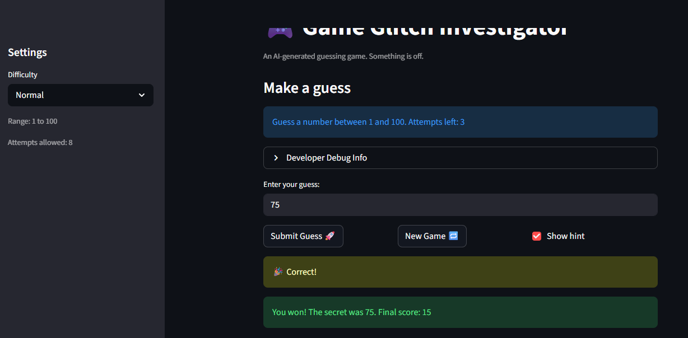

# 🎮 Game Glitch Investigator: The Impossible Guesser

## 🚨 The Situation

You asked an AI to build a simple "Number Guessing Game" using Streamlit.
It wrote the code, ran away, and now the game is unplayable. 

- You can't win.
- The hints lie to you.
- The secret number seems to have commitment issues.

## 🛠️ Setup

1. Install dependencies: `pip install -r requirements.txt`
2. Run the broken app: `python -m streamlit run app.py`

## 🕵️‍♂️ Your Mission

1. **Play the game.** Open the "Developer Debug Info" tab in the app to see the secret number. Try to win.
2. **Find the State Bug.** Why does the secret number change every time you click "Submit"? Ask ChatGPT: *"How do I keep a variable from resetting in Streamlit when I click a button?"*
3. **Fix the Logic.** The hints ("Higher/Lower") are wrong. Fix them.
4. **Refactor & Test.** - Move the logic into `logic_utils.py`.
   - Run `pytest` in your terminal.
   - Keep fixing until all tests pass!

## 📝 Document Your Experience

- [x] **Game purpose:** A number guessing game built with Streamlit where the player tries to guess a randomly generated secret number within a limited number of attempts. The player selects a difficulty (Easy, Normal, or Hard) which controls the number range and attempt limit, and receives higher/lower hints after each guess to narrow down the answer.

- [x] **Bugs found:**
  1. **New game was unplayable after a win or loss** — clicking "New Game" reset the attempt counter but never reset `status`, so the app immediately hit `st.stop()` and blocked the player.
  2. **Hints were backwards** — when the guess was too high, the app said "Go HIGHER"; when too low, it said "Go LOWER". The messages in `check_guess` were swapped.
  3. **Out-of-range guesses were accepted** — there was no validation to reject numbers outside the difficulty range, so negative numbers and values above the max all passed through.
  4. **Difficulty change didn't update the game** — switching difficulty mid-session kept the old secret (generated for a different range) and showed a hardcoded "1 to 100" hint regardless of the selected difficulty. The Hard range was also set to 1–50, smaller than Normal's 1–100.

- [x] **Fixes applied:**
  1. Added `st.session_state.status = "playing"` and history reset to the "New Game" button handler.
  2. Swapped the return messages in `check_guess` so "Too High" → "Go LOWER" and "Too Low" → "Go HIGHER" (fixed in both the numeric and string-comparison code paths).
  3. Added a bounds check after `parse_guess`; out-of-range guesses show an error and don't consume an attempt.
  4. Added a `secret_difficulty` key to session state to detect difficulty changes and auto-reset the game with a new secret in the correct range. Updated the hint text and "New Game" secret generation to use `low`/`high` variables instead of hardcoded values. Corrected the Hard range from 1–50 to 1–200.

## 📸 Demo

- [ ] [Insert a screenshot of your fixed, winning game here]

## 🚀 Stretch Features

- [ ] [If you choose to complete Challenge 4, insert a screenshot of your Enhanced Game UI here]
